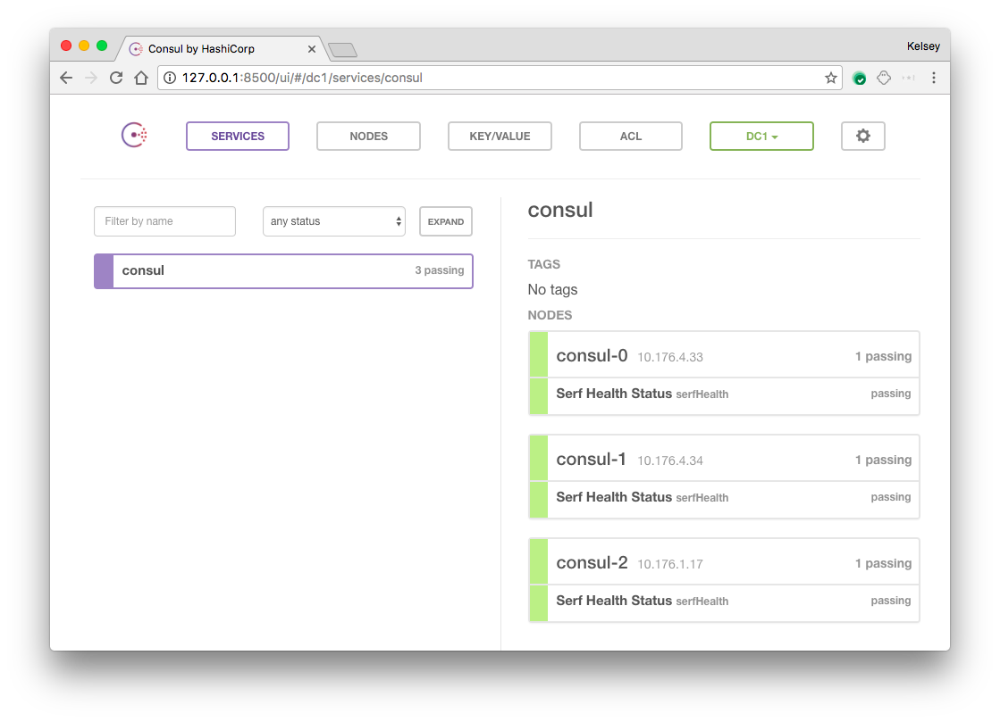

# kubernetes-Consul


Zero bullshit scalable consul

No TLS. Use a mesh network.

Based on Hightowers repo but fixed for me to work.

### Dependencies

Simpler version of helm

`go get github.com/AlexsJones/vortex`  

Get this stuff working...

```
./build_environment.sh small
kubectl create -f deployment/
```

AWAY YOU GO!


### Notes

You might want to change the sts GOSSIP_ENCRYPTION_KEY with `consul keygen`

### Accessing the Web UI

The Consul UI does not support any form of authentication out of the box so it should not be exposed. To access the web UI, start a port-forward session to the `consul-0` Pod in a new terminal.

```
kubectl port-forward consul-0 8500:8500
```

Visit http://127.0.0.1:8500 in your web browser.


